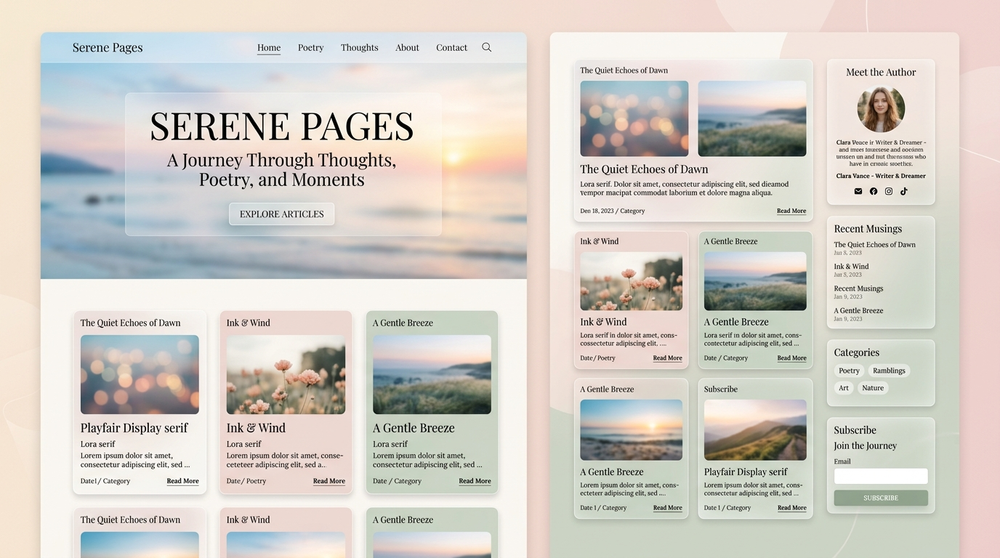
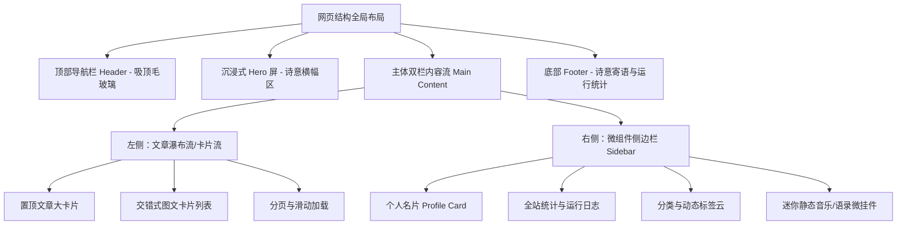

# 🌸 POETIZE 风格全新 UI 设计规范与重构方案

> **设计理念**：“诗意栖居的数字花园” —— 融合 **Poetize** 极致美学精髓与 **Astro** 纯粹静态构建优势，将普通静态文档博客升级为高颜值、有温度的现代数字化个人空间。

---

## 一、UI 设计效果图 (Visual Design Mockup)

结合 Poetize 项目（`E:\Coding\poetize`）的核心视觉特征（梦幻渐变、毛玻璃拟态、双栏精致卡片流、沉浸式大图 Banner、优雅衬线排版）设计的全新博客桌面端与移动端主视觉概念效果：



---

## 二、背景与重构目标

### 1. 现有项目痛点
- **版式单调**：原有页面多为居中紧凑单栏或极简粗糙列表，缺乏视觉重心与层次感。
- **美感与质感不足**：缺少阴影层级、微动效与毛玻璃质感，整体观感偏朴素的内部文档风格。
- **缺乏互动与个性表达**：缺少作者专属名片、标签云、统计徽章与沉浸式 Banner 等个人表达元素。

### 2. 重构目标（基于 Poetize 参考精髓）
- **高颜值视觉语言**：引入 **Glassmorphism（毛玻璃拟态）**、柔和弥散阴影、圆角卡片系统。
- **沉浸式首屏体验**：设计具有诗意与呼吸感的主视觉横幅（Hero Section），支持诗意寄语与动态打字机效果。
- **双栏流水布局**：主内容区呈现“交错式图文卡片流”，侧边栏集成“作者名片 + 分类标签云 + 近期精选”。
- **极速纯粹**：在全面提升视觉表现力的同时，继续保留当前 Astro 的 0 客户端 JS 开销优势，动效优先采用现代原生 CSS 实现。

---

## 三、视觉系统规范 (Design System Tokens)

### 1. 色彩体系 (Color Palette)

| 色彩角色 | 色值 (Light 浅色模式) | 色值 (Dark 深色模式) | 适用场景 |
| :--- | :--- | :--- | :--- |
| **主品牌色 (Primary)** | `#FF758C` / `#4E65FF` 渐变 | `#FF8E9E` / `#6579FF` | 按钮、选中高亮、重点渐变背景 |
| **辅色 / 强调色** | `#42E695` / `#FFA07A` | `#4BECA2` / `#FFB190` | 分类徽章、状态指示器、链接悬停 |
| **页面底色 (Background)** | `#F7F9FC` 搭配柔和光斑渐变 | `#0F141C` 深度深空灰 | 全局网页背景 |
| **卡片背景 (Card Glass)** | `rgba(255, 255, 255, 0.78)` | `rgba(26, 34, 48, 0.75)` | 文章卡片、侧边栏卡片、导航栏 |
| **毛玻璃边框 (Border)** | `rgba(255, 255, 255, 0.85)` | `rgba(255, 255, 255, 0.08)` | 卡片 1px 细高光边框 |
| **主文字颜色** | `#2C3E50` | `#EDF2F7` | 标题、正文核心内容 |
| **次级文本颜色** | `#718096` | `#A0AEC0` | 日期、摘要、阅读时长、统计数字 |

### 2. 质感与阴影系统 (Glassmorphism & Shadows)

```css
:root {
  /* 毛玻璃模糊度 */
  --glass-blur: blur(16px);
  
  /* 多层轻盈弥散投影 */
  --shadow-sm: 0 2px 8px rgba(0, 0, 0, 0.04);
  --shadow-card: 0 10px 30px -5px rgba(0, 0, 0, 0.05), 0 0 1px rgba(0, 0, 0, 0.1);
  --shadow-hover: 0 20px 40px -10px rgba(0, 0, 0, 0.12), 0 0 1px rgba(0, 0, 0, 0.2);
  
  /* 柔和圆角体系 */
  --radius-sm: 8px;
  --radius-md: 14px;
  --radius-lg: 20px;
  --radius-full: 9999px;
}
```

### 3. 排版与字体体系 (Typography)
- **英文/数字主标题**：优雅衬线体（*Playfair Display* 或 *Lora*），赋予“作诗/诗意”的情绪氛围。
- **中文正文字体**：`-apple-system, BlinkMacSystemFont, "PingFang SC", "Hiragino Sans GB", "Microsoft YaHei", "Noto Serif SC", serif`，标题兼具思源宋体的优雅与阅读舒适性。
- **代码字体**：`JetBrains Mono, Fira Code, monospace`。

---

## 四、核心页面与组件架构设计



### 1. 顶部导航栏 (Glassmorphic Sticky Header)
- **视觉特性**：滚动前完全透明，融入 Hero 背景；滚动后平滑过渡至 `backdrop-filter: blur(12px)` 半透明白/暗色磨砂质感。
- **左侧**：诗意站点 Logo（如带呼吸微光的图标 + "PUTL · NOTES"）。
- **中间**：快捷导航（首页、文章列表、专栏分类、归档、关于我）。带有悬浮彩色下划线胶囊动效。
- **右侧**：
  - 搜索按钮（触发快捷弹窗，支持 `Ctrl/Cmd + K`）。
  - 明亮/暗黑模式平滑切换按钮。
  - GitHub 仓库联动外链徽章。

### 2. 首屏横幅区 (Immersive Hero Banner)
- **背景层**：柔和意境大图（如晨曦海岸、薄雾森林、星空），加 `mask-image` 底部渐变羽化，自然过渡到内容区。
- **中心卡片**：悬浮毛玻璃胶囊/小方卡，呈现：
  - 大字主标：如 `记录那些值得留下的东西` 或 `诗意栖居的数字花园`。
  - 动态打字机副标：`“做出来只是开始，在不断构建的过程中逐渐看清问题。”`
  - 引导按钮：`开始探索 ➔` 平滑滚动锚点。
- **波浪动效**：底部可选轻量纯 CSS 动态波浪层（Poetize 标志性元素），打破生硬直角分界。

### 3. 文章卡片列表 (Alternating Modern Cards)
- **交错排版**：奇数卡片采用「左封面图 + 右内容文本」，偶数卡片采用「左内容文本 + 右封面图」。
- **卡片组成**：
  - **封面图**：16:10 黄金比例，圆角裁切，hover 时微缩放 `transform: scale(1.04)`。
  - **顶部标签**：分类彩色药丸徽章（如 `前端`、`架构`、`诗与思考`）。
  - **标题**：字重 700，hover 变品牌渐变色。
  - **摘要**：2~3 行省略，灰度适中，字间距舒缓。
  - **卡片底栏**：发布日期、字数预估、阅读时间标签、"阅读全文 →" 微动效。
- **微交互**：鼠标悬停整体卡片上浮 `translateY(-6px)`，阴影从淡柔扩散为深邃氛围光晕。

### 4. 侧边栏微组件 (Sidebar Widgets)
1. **个人名片卡 (Profile Card)**：
   - 圆形悬浮头像（hover 旋转或发光光圈）。
   - 昵称、身份标签（Fullstack Developer / Digital Gardener）。
   - 文章数、分类数、标签数 3 栏数据统计。
   - 社交媒体极简图标矩阵（GitHub、Twitter、Email、RSS）。
2. **分类与标签云 (Categories & Tag Cloud)**：
   - 采用圆角药丸标签，根据文章数量动态呈现浅色透明背景或渐变重点色。
3. **站点运行与状态小部件 (Status & Quote Widget)**：
   - 诗意一言（每日一言诗句）。
   - 动态运行天数计时器（如 `🌱 数字花园已耕耘 128 天`）。

### 5. 文章正文阅读页 (Article Layout & TOC)
- **顶部全宽封面**：沉浸式题图，标题覆盖其上，带有发布日期、更新时间、分类、字数等元数据。
- **顶部阅读进度条**：网页最顶端 3px 渐变细条，随滚动百分比动态增长。
- **双栏排版**：
  - 左侧：舒适排版正文（字体大小 18px，行高 1.8，代码块带 Mac 风格三色圆点、语言徽标与一键复制功能）。
  - 右侧：**悬浮目录 (Sticky TOC)**，根据当前屏幕浏览位置自动高亮章节标题。
- **文末模块**：
  - 原创版权声明卡片（CC BY-NC-SA 4.0 规范）。
  - 上一篇 / 下一篇导航切换大卡片。

---

## 五、Astro 静态化落地改造技术路线

由于当前项目为 **Astro 5.x** 架构，本次 UI 升级完全兼容现有的静态生成与 Markdown 文件管理逻辑：

### 阶段一：基础样式与设计系统接入
1. 升级 `src/styles/global.css`，注入 Poetize 风格的 CSS 变量（毛玻璃滤镜、阴影梯队、色彩与圆角）。
2. 配置字体加载器（引入优雅的中英文字体层级）。

### 阶段二：组件重构与解耦
- 重构 `src/components/Header.astro`（加入毛玻璃与滚动交互）。
- 新增 `src/components/Hero.astro`（首页大图与打字机寄语）。
- 新增 `src/components/ArticleCard.astro`（交错式图文卡片）。
- 新增 `src/components/Sidebar.astro`（个人名片、统计与标签云）。
- 重构 `src/layouts/BlogPost.astro`（增加顶部题图、阅读进度条、代码块复制与文章目录 TOC）。

### 阶段三：页面组合与动效润色
- 改造 `src/pages/index.astro` 为双栏现代诗意流首页。
- 改造 `src/pages/blog/index.astro` 提供分类过滤与瀑布流视图。
- 添加轻量平滑滚动与卡片浮动过渡效果。

---

## 六、总结

本套设计方案汲取了 **Poetize** 作为“最美开源博客”在**视觉感染力、卡片拟态层次、诗意氛围塑造**上的核心优势，同时契合当前仓库的**纯静态轻量架构（Astro + Markdown）**，既解决了现有文档页面简陋、缺乏美感的问题，又保证了加载速度极快、SEO友好和低维护成本。
